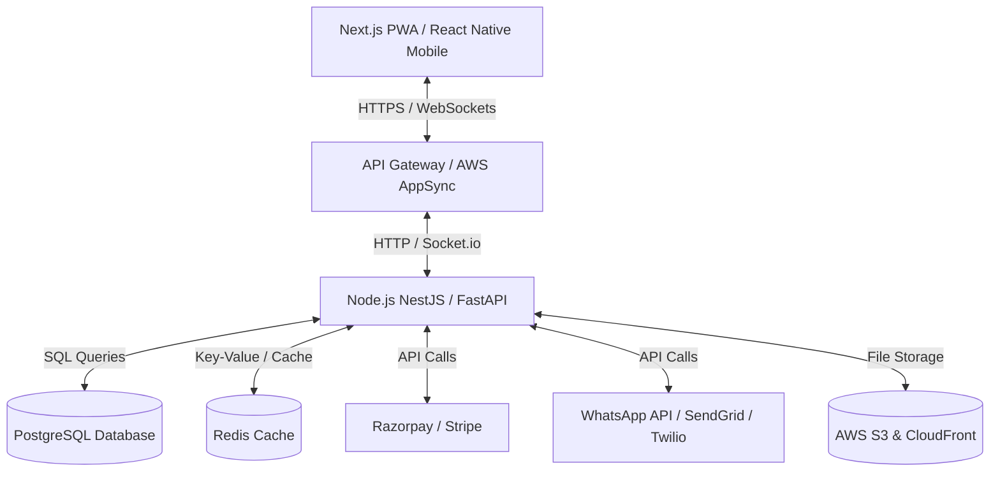

My name is **Mackrine Ruth**, and I am from **Mathur, Thanjavur**. I completed my Bachelor's degree in **B.Sc. Computer Science** at **Bishop Heber College, Tiruchirappalli**.

After graduating, I spent **eight months completing several certification courses** to strengthen my technical and practical skills in web development and related technologies.

In **March 2026**, I joined **TYM Agency (The Youth Mint)** as a **Web Development Intern**.

During my internship, I have gained hands-on experience in understanding business requirements, designing and developing portfolio websites, and creating web solutions that help businesses strengthen their online presence and achieve their goals. This experience has enhanced both my technical expertise and my understanding of how web development can contribute to business growth.

Currently, I am working as a **Web Development Intern** at **TYM Agency (The Youth Mint)**, where I continue to improve my web development skills while delivering value-driven solutions for clients.
my showcase portfolios, techstacks, 
# Tech Stack — AVIKA Boutique

AVIKA Boutique is a premium, high-performance static website built using modern, lightweight web technologies optimized for speed, luxury aesthetics, and responsive layout.

---

## 1. Core Technologies

- **HTML5 (HyperText Markup Language)**
  - Structured using semantic elements (`<header>`, `<nav>`, `<main>`, `<section>`, `<footer>`, etc.) to enhance search engine optimization (SEO) and accessibility (A11y).
  - Clean heading hierarchy containing exactly one `<h1>` per page.
  - Fully optimized meta tags including mobile-responsive viewport configuration and descriptive meta descriptions for enhanced SEO score.

- **CSS3 (Cascading Style Sheets)**
  - Written in modular, highly structured Vanilla CSS (`css/style.css`).
  - Utilizes CSS Custom Properties (Variables) to maintain a cohesive, premium design system (luxury warm/gold tones, sophisticated typography, and harmonious transitions).
  - Employs modern layout systems like CSS Flexbox and CSS Grid for fluid, responsive, and adaptive columns.

- **Vanilla JavaScript (ES6+)**
  - Lightweight, native logic (`js/main.js`) with zero external library dependencies (e.g. jQuery, React) ensuring instantaneous loading times and excellent performance metrics.
  - Powered by modern APIs such as the `IntersectionObserver` to handle scroll-triggered fade-in micro-animations efficiently.

---

## 2. Key Interactive Features & Architecture

### Navigation & Layout Controls
- **Responsive Mobile Navigation**: A slide-out navigation panel with a custom hamburger toggle animation and programmatic background body-scroll locking to ensure a premium mobile experience.
- **Scroll-Adaptive Header**: A dynamic top navigation bar that transitions from a transparent background overlay to a solid/frosted glassmorphism design when the user scrolls past 50 pixels.
- **Back-to-Top Indicator**: A subtle, floating action button that appears when scrolling down the page, providing users with a smooth-scroll return back to the top viewport.

### Performance & Animation System
- **Intersection Observer Animations**: Uses an asynchronous observer to fade in content elements as they enter the viewport.
- **Flash of Invisible Content (FOIC) Prevention**: Immediate checks are run for elements already in the viewport to apply visibility classes immediately, avoiding jarring layout shifts on first paint.
- **Smooth Anchor Scroll**: Anchor link handler with built-in height offsets to prevent header overlap when jumping to page sections.

### Testimonial Carousel
- Built with a custom, fully responsive multi-card slider system.
- Calculates and shows 1, 2, or 3 cards simultaneously depending on the window width (`innerWidth`).
- **Autoplay Loop**: Automatically advances slides every 3 seconds.
- **Pause on Interaction**: Automatically pauses the autoplay loop on mouse hover or touch gesture interactions.
- **Dynamic Pagination**: Auto-generates indicator dots corresponding to the page count, recalculating dynamically upon window resize event triggers.

---

## 3. Typography & Styling System

The brand's aesthetic is built around Google Fonts to showcase a premium fashion editorial feel:
- **Playfair Display**: A classic, high-contrast serif font used for elegant display titles.
- **Cormorant Garamond**: An exquisite, traditional serif font used for secondary headings and brand quotes.
- **Inter**: A clean, highly readable geometric sans-serif font utilized for clean, modern body copy and navigation.

# Tech Stack — Madhavi Mehandi

Madhavi Mehandi is a premium, high-performance static website built using modern, lightweight web technologies optimized for speed, luxury aesthetics, and interactive portfolios.

---

## 1. Core Technologies

- **HTML5 (HyperText Markup Language)**
  - Structured using semantic, accessible HTML5 elements (`<nav>`, `<header>`, `<main>`, `<section>`, `<article>`, `<footer>`) to promote clean search engine indexing (SEO) and screen-reader accessibility (A11y).
  - Implements standard structured heading rules with exactly one `<h1>` per page.
  - Fully optimized meta tags, including mobile-responsive viewport setups and localized meta descriptions for search visibility.

- **CSS3 (Cascading Style Sheets)**
  - Written in structured, high-performance Vanilla CSS (`css/style.css`) using BEM (Block-Element-Modifier) naming conventions (`.nav__brand`, `.nav__list`, `.nav__toggle--open`).
  - Utilizes CSS Custom Properties (Variables) to manage the design system tokens (luxury gold palette, creams, charcoal, typography scale, shadows, transitions, and layers).
  - Uses CSS Flexbox and Grid systems for fully fluid and adaptive multi-column layouts across all screen resolutions.
  - Employs responsive font sizing using CSS `clamp()` (e.g. `clamp(2.8rem, 7vw, 5.5rem)`) for typography fluid scaling.

- **Vanilla JavaScript (ES6+)**
  - Lightweight, native JavaScript (`js/main.js`) written inside a clean IIFE (Immediately Invoked Function Expression) to protect global namespace.
  - Zero external library dependencies (e.g., jQuery, React, or lightbox plugins) guaranteeing instant load speeds and a 100% PageSpeed performance foundation.

---

## 2. Key Interactive Features & Architecture

### Navigation & Header Systems
- **Responsive Mobile Navigation**: A slide-out navigation overlay with a custom-animated hamburger toggle (`span` transitions). Includes programmatic body overflow locking (`document.body.style.overflow = 'hidden'`) to prevent double scrolling.
- **Scroll-Adaptive Nav Header**: Automatically monitors viewport scroll positions relative to the hero section, applying a frosted-glass background overlay (`backdrop-filter: blur(24px)`) and adding shadow borders once the threshold is crossed.
- **Auto-Fading Scroll Indicator**: A floating scroll cue at the bottom of the hero page that dynamically fades out as the user scrolls past 65% of the hero height to maintain visual clarity.

### Media & Video Systems
- **Auto-playing Background Video**: The hero banner integrates a looping HTML5 `<video>` background.
- **Fail-safe Image Fallback**: Automatically checks the video's load readiness. If loading fails or takes too long, it displays a background image poster instead, avoiding a blank space or loading spinner.

### Portfolio Gallery & Lightbox (Gallery Page)
- **Interactive Category Filter**: Categorizes items using custom attributes (`data-cat` and `data-filter`). When a tab is clicked, JS toggles item visibility and triggers a keyframe-backed scale/fade-in animation (`fadeIn` via injected `<style>`).
- **Custom Lightbox Viewer**: A modal lightbox component triggered by clicking any gallery item. Includes smooth open/close states, full image source mirroring, and supports closing via cross button, clicking outside the modal, or hitting the `Escape` key.

### Performance & Animation Systems
- **Scroll Reveal Animations**: Uses an asynchronous `IntersectionObserver` to trigger elegant fade-in-up animations on elements (`.reveal`) as they enter the viewport, unobserving elements after they fire to optimize memory footprint.
- **Smooth Anchor Scroll**: Utilizes native CSS `scroll-behavior: smooth` for elegant jumping between sections.

---

## 3. Typography & Brand Tokens

The design is built around curated typography to project a premium fashion-editorial atmosphere:
- **Playfair Display**: An elegant display serif font used for luxury headings and titles.
- **Inter**: A clean, modern geometric sans-serif font utilized for UI elements, bodies, and forms.


# Technology Stack and Guidelines

This document outlines the technical stack, architectural patterns, and development guidelines for the **TYM Jewellery** website project.

---

## 1. Core Architecture

The project is structured as a **Serverless Static Single Page Application (SPA)** designed for instant loading, high security, and zero server maintenance costs.

*   **Hosting**: 100% client-side. Suitable for free-tier static hosting platforms (e.g., GitHub Pages, Vercel, Netlify, Cloudflare Pages).
*   **Database/Backend**: None. Dynamic interactions, inquiries, and routing are managed client-side.

---

## 2. Technology Stack

To ensure maximum performance and maintainability, the project enforces strict technical limitations:

| Technology | Role | Version / Constraints |
| :--- | :--- | :--- |
| **HTML5** | Content & Semantic Structure | Strict semantic elements (`<header>`, `<main>`, `<section>`, `<footer-desk>`, `<dialog>`). |
| **CSS3** | Layout, Design & Animation | Native CSS only. **ABSOLUTELY NO** frameworks or utility libraries (No Tailwind, Bootstrap, Sass). |
| **Vanilla JavaScript** | DOM Manipulation & Routing | Pure JS ES6+. **ABSOLUTELY NO** frameworks (No React, Vue, Angular, jQuery). |

---

## 3. Key Feature Implementations

### A. Routing & Messaging
*   **WhatsApp API Integration**: Action buttons (e.g., `BOOK ON WHATSAPP`) dynamically construct pre-filled query strings and redirect to the business contact:
    ```javascript
    const baseUri = "https://wa.me/916381649243";
    const textPayload = encodeURIComponent("Hello TYM Jewellery... I’m interested in this collection. Could you please share more details and pricing?");
    window.location.href = `${baseUri}?text=${textPayload}`;
    ```

### B. UI Interactions
*   **Hidden Category Drawer**: A slide-out side portal holding the 14 master categories. Clicking a master category displays up to 6 custom products (e.g., `attigai-1` to `attigai-6`) mapped dynamically via JS.
*   **Infinite Feedback Slider**: Driven by CSS keyframes. Pauses automatically on hover or touch using simple event listeners:
    ```javascript
    const slider = document.querySelector('.feedback-slider');
    slider.addEventListener('mouseenter', () => slider.style.animationPlayState = 'paused');
    slider.addEventListener('mouseleave', () => slider.style.animationPlayState = 'running');
    ```
*   **FAQ Accordion**: 5 question blocks with smooth height and rotation transitions using CSS flex/grid and minimal JS toggles.
*   **Care Policy Modal**: Sliding overlays triggered via class lists.

### C. Responsiveness
*   All layouts are crafted natively using standard **CSS Flexbox** and **CSS Grid**.
*   Responsive adjustments are managed via CSS media queries for desktop, tablet, and mobile breakpoints.

---

## 4. Asset Guidelines

*   **Icons**: Golden inline SVG icons for premium styling, crisp rendering, and fast loading.
*   **Images**: Optimized JPG/PNG files under `/assets/`.
*   **Brand Logo**: `/assets/brand-logo.png`
*   **Signature Logo**: `/assets/tym-agency-signature-logo.svg`


# TYM Events — Technical Stack Specification

This document outlines the current technical architecture and the planned future-state stack for the **TYM Events** platform.

---

## 1. Current Frontend Prototype Stack

The initial version of TYM Events is implemented as a premium, lightweight, static frontend application optimized for page load speeds, SEO performance, and responsive mobile rendering.

### 1.1 Core Languages & Markup
*   **HTML5**: Semantic document structure to ensure accessibility and SEO readiness.
*   **CSS3**: Style sheets organizing structural layouts, custom grids, and theme typography:
    *   `css/style.css`: Contains variables, main design system parameters, component layouts, and a dark/gold theme implementation.
    *   `css/responsive.css`: Handles media query break-points for mobile, tablet, and desktop viewports.
*   **Vanilla JavaScript (ES6+)**: Custom dynamic modules with zero framework or third-party package dependencies:
    *   `js/main.js`: Implements smooth mobile navigation drawers, IntersectionObserver-triggered scroll animations, statistical milestone count-up animations, and FAQ accordion controls.

### 1.2 Assets & Typography
*   **Vector Graphics**: Pure inline SVG definitions used for iconography and brand patterns to minimize request calls.
*   **Web Fonts**: Embedded from Google Fonts:
    *   `Inter` (Clean sans-serif for reading/body text)
    *   `Playfair Display` (Luxury serif for headings/accents)
    *   `Noto Sans Tamil` (To support localized language translation)
*   **Photography**: Curated high-resolution images mapping traditional and contemporary Tamil Nadu wedding, community, and corporate events.

---

## 2. Planned Target Architecture (Future State)

As detailed in the [Product Requirements Document](file:///c:/Users/acer/Desktop/TYM-Events/PRD_TYM_Events.md#L477-L484), the transition to a full SaaS and vendor marketplace will deploy the following scalable enterprise stack:



### 2.1 Frontend & Client Tier
*   **Web Framework**: Next.js (React) configured with TypeScript for type safety and compilation verification.
*   **Styling**: TailwindCSS for component modularity.
*   **Mobile Platform**: React Native (planned for Phase 2 implementation).
*   **Visual States**: Progressive Web App (PWA) with offline capabilities.

### 2.2 Backend & Data Tier
*   **Application Server**: Node.js utilizing the NestJS framework (or Python FastAPI for algorithmic workloads).
*   **Databases**: 
    *   **PostgreSQL**: Primary transactional database for user accounts, contracts, payments, and event details.
    *   **Redis**: In-memory store for session tokens, real-time message caching, and scheduling operations.
*   **Real-Time Sync**: WebSockets or AWS AppSync for instant event dashboard timelines, live guest photo streams, and status updates.

### 2.3 Cloud Infrastructure & Operations
*   **Hosting**: Amazon Web Services (AWS) using:
    *   **AWS ECS / Fargate**: Container orchestration.
    *   **AWS RDS**: Managed PostgreSQL database.
    *   **AWS S3 & CloudFront**: Media storage and global CDN caching.
*   **DevOps**: GitHub Actions pipelines compiling Dockerized build configurations.

### 2.4 External Service Integrations
*   **Payment Gateways**: Razorpay (optimized for INR cards, UPI, and local wallets) and Stripe.
*   **Message Brokers**: WhatsApp Business API (primary customer contact interface), Twilio (SMS triggers), and SendGrid (transactional receipts).
*   **Calendars**: Google Calendar, Outlook, and iCal synchronizations.


# TYM Electricals & Hardware - Tech Stack Documentation

This document outlines the technical architecture, frameworks, libraries, and design patterns utilized in the **TYM Electricals & Hardware** web application.

---

## 🏗️ Architectural Overview

The application is structured as a **modern, high-performance static multi-page website**. This architecture was selected to achieve:
1. **Instant Loading Times**: Zero server-side rendering or database latency.
2. **SEO Optimization**: Raw HTML is fully indexable by search engine crawlers out of the box.
3. **Zero Maintenance & Cost**: Hosted entirely serverless (e.g., GitHub Pages, Netlify, or Vercel).
4. **Security**: No database, backend forms, or APIs to exploit.

---

## 💻 Tech Stack Breakdown

### 1. Structure & Markup (HTML5)
* **Semantic HTML5**: Employs structural elements like `<header>`, `<nav>`, `<main>`, `<section>`, `<article>`, and `<footer>` to establish a clear document outline for screen readers and search engines.
* **SEO Metadata**: Optimized meta tags (description, keywords, viewport) configured individually on each page to maximize search visibility.
* **Inline SVGs**: Avoids icon fonts (like FontAwesome) or multiple icon image files. Icons are embedded as inline SVG elements to reduce network requests, avoid render-blocking assets, and allow CSS-driven dynamic coloring.

### 2. Styling & Layout (Vanilla CSS3)
A custom, lightweight design system is implemented in `css/style.css`.
* **CSS Custom Properties (Variables)**: Configured globally in the `:root` pseudo-class to store structural theme tokens:
  * **Color Palette**: Dark deep blues (`#0a0f1a`, `#132044`), warm golds (`#c9952e`, `#e8c468`), and clean off-whites (`#f5f4f1`, `#efede9`).
  * **Typography**: Imported Google Font **Inter** (weights 300 through 800) with system fallbacks.
  * **Spacing & Shadows**: Standardized border-radii (`--radius`, `--radius-lg`) and shadows (`--shadow-md`, `--shadow-glow`).
* **Modern CSS Features**:
  * **CSS Grid & Flexbox**: Powering multi-column section grids (e.g., product range, stats, service cards) and aligning navigation headers responsive to device viewports.
  * **Glassmorphism**: Applied to the sticky navigation header using `backdrop-filter: blur(20px)` and semi-transparent background colors.
  * **Transitions & Animations**: Custom CSS `@keyframes` animations (e.g., the bouncing scroll indicator in the hero section) and transitions matching natural bezier curves (`cubic-bezier(0.4, 0, 0.2, 1)`).

### 3. Client-Side Functionality (Vanilla JavaScript)
All interactivity is managed in `js/script.js` without relying on bulky libraries like jQuery or frameworks like React.
* **Intersection Observer API**: Used to implement scroll-triggered entrance animations. As elements with the `.animate` class cross the viewport threshold, JavaScript attaches the `.visible` class to transition opacity and translate properties.
* **Mobile Drawer Navigation**: Responsive click/touch event listeners toggle mobile navigation layouts, control drawer visibility, and toggle body scroll prevention.
* **Custom Testimonial Carousel**:
  * Pure JS track translation using `translateX` percentage calculations.
  * Interactive pagination dots generated dynamically based on slide count.
  * Automatic rotation every 5 seconds, which temporarily suspends when the cursor hovers over the container (`mouseenter` / `mouseleave`).
* **Lead Generation via WhatsApp Link API**: Rather than exposing emails to spam or managing a custom SMTP server, the contact enquiry form handles submission events, extracts parameters, URL-encodes the message, and redirects the client to the WhatsApp API (`https://wa.me/+916381649243`).

---

## 📂 Project Directory Structure

```text
TYM-Hardware/
├── css/
│   └── style.css            # Main custom stylesheet (Variables, grid layout, animations)
├── js/
│   └── script.js           # Interactive UI logic (Observer, carousel, mobile menu, form)
├── image/                  # Static image files and logo assets
├── index.html              # Landing Page / Home
├── about.html              # About Business Page
├── products.html           # Full Product Range Catalog
├── contact.html            # Contact & Enquiry Form
├── quality-pledge.html     # Trust & Quality Statement
├── delivery-policy.html    # Customer Delivery Information
├── terms-of-service.html   # User Terms Agreement
├── privacy-policy.html     # Data Privacy Statement
├── prd.md                  # Product Requirements Document
├── assets.md               # Asset reference mapping
└── techstack.md            # Tech stack documentation (this file)
```

---

## ⚡ Performance & Optimization Standards

* **Zero Bundling Overhead**: Direct script and style imports, meaning zero time spent running compilers during development or deployment.
* **No Render-Blocking Frameworks**: Pages load and render HTML and CSS layout skeletons instantly.
* **Caching Friendly**: CSS and JS are separate cacheable files, speeding up multi-page navigation for returning visitors.


## Questions and Answers 

Section 1: Personal & Professional Identity
Professional Title Tagline:
How do you want to introduce yourself?
Frontend Web Developer & UI Designer                                                                                       
In one or two sentences, what do you want visitors to understand about you immediately?
I build fast, responsive, and visually engaging websites that combine clean design with seamless user experiences. I'm passionate about creating modern web solutions that help businesses establish a strong online presence while continuously improving my skills as a frontend developer. 
Languages You Speak/Write:
English, Tamil. 
Should the website be bilingual?
      - Yes. The website should support both English and Tamil based on the client's requirements. 
Section 2: Target Audience
Who is this portfolio for?
 i want to create a portfolio website to showcase my skills, projects, experience, and creativity, helping attract clients or employers and build a professional online presence.
What should a visitor do after viewing your portfolio?
Contact me via Email
Call or WhatsApp me
Download my Resume
View my Projects
Connect with me on LinkedIn
Visit my GitHub profile
Section 3: Design & Branding
Brand Name for the Portfolio:
Mackrine Ruth(what you suggest me)
Color Palette Preference:
Do you have specific colors in mind? 
Suggested Gradient Color Palette
Primary Gradient:
#4F46E5 → #06B6D4
(Indigo → Cyan)
Secondary Gradient:
#7C3AED → #3B82F6
(Purple → Blue)
Accent Gradient:
#06B6D4 → #14B8A6
(Cyan → Teal)
Background Gradient:
#F8FAFC → #E0F2FE
(Soft White → Light Blue)
Text:
#0F172A
Surface / Cards:
#FFFFFF

Vibe / Aesthetic Direction:
Pick the closest match or describe your own:
[> ] Clean & Minimal (Apple/Notion style)
[> ] Dark & Premium (TYM Jewellery style)
[> ] Modern & Corporate (TYM Electricals style)
[> ] Creative & Playful (animations, bold colors)
[ ] Other: suggest me
Typography Preference:
Do you like serif fonts (elegant, classic) or sans-serif (modern, clean)? Any specific font you love?
 both serif fonts and sans-serif
Personal Photo:
Do you have a professional headshot? 
yes, i have a professional headshot. 
Section 4: Website Structure & Pages
Single-Page vs. Multi-Page:
Do you want a single scrolling page (Home → About → Projects → Contact) or separate pages?
 Multi-page website 
Required Sections — mark all you want:
Table
Section	Want it?	Priority
Hero / Home Banner	- High
About Me	- High
Skills / Tech Stack - / Medium
Projects / Portfolio Showcase	- high
Experience / Timeline	- Medium
Education	- Low
Certifications	- Low
Resume / CV Download	- Medium
Contact Form / Info	- High
Footer	- Low
Navigation Labels:
What do you want the menu items to say?
Home, About, Work, Skills, Contact — English
Section 5: Projects Showcase (The Most Important Section)
List ALL projects you want to showcase (including the ones from your file and any personal/college projects):
-Project 1
Project Name:
 AVIKA Boutique
Category:
 Business Website / Boutique Website
Your Role:
 Frontend Developer
Tech Stack Used:
 HTML5, CSS3 (Vanilla CSS), Vanilla JavaScript (ES6+)
Live Link:
 Available
GitHub / Source Link:
 Public
Short Description:
 A premium boutique website designed with a luxury aesthetic to showcase fashion collections, brand identity, and customer testimonials. The website emphasizes responsive design, performance, and an elegant user experience.
Key Features You Built:
Responsive Mobile Navigation
Scroll-Adaptive Header
Scroll Reveal Animations
Testimonial Carousel
Back-to-Top Button
Smooth Scrolling
SEO Optimized Structure
Responsive Grid Layout
Screenshots:
 Yes

- Project 2
Project Name:
 Madhavi Mehandi
Category:
 Portfolio / Business Website
Your Role:
 Frontend Developer
Tech Stack Used:
 HTML5, CSS3 (Vanilla CSS), Vanilla JavaScript (ES6+)
Live Link:
 Available
GitHub / Source Link:
 Public
Short Description:
 A premium portfolio website for a professional mehendi artist featuring elegant branding, interactive galleries, responsive layouts, and modern user interactions to showcase services and artwork.
Key Features You Built:
Responsive Navigation
Hero Background Video
Portfolio Gallery
Custom Lightbox
Gallery Category Filters
Scroll Animations
Smooth Scrolling
Mobile Optimized Design
Screenshots:
 Yes

- Project 3
Project Name:
 TYM Jewellery
Category:
 Business Website / Jewellery Store
Your Role:
 Frontend Developer
Tech Stack Used:
 HTML5, CSS3 (Vanilla CSS), Vanilla JavaScript (ES6+)
Live Link:
 Available
GitHub / Source Link:
 Public
Short Description:
 A premium jewellery business website developed with a luxury design approach to showcase collections, improve customer engagement, and simplify inquiries through WhatsApp integration.
Key Features You Built:
WhatsApp Integration
Responsive Navigation
Category Drawer
Infinite Testimonial Slider
FAQ Accordion
Care Policy Modal
Responsive Layout
SEO Optimized Pages
Screenshots:
 Yes

- Project 4
Project Name:
 TYM Events
Category:
 Event Management Website
Your Role:
 Frontend Developer
Tech Stack Used:
 HTML5, CSS3 (Vanilla CSS), Vanilla JavaScript (ES6+)
Live Link:
 Available
GitHub / Source Link:
 Public
Short Description:
 A modern event management website designed to showcase event planning services with a premium interface, responsive layouts, engaging animations, and optimized performance.
Key Features You Built:
Responsive Navigation
Hero Section
Scroll Reveal Animations
Statistics Counter
FAQ Accordion
Responsive Layout
SEO-Friendly Structure
Performance Optimization
Screenshots:
 Yes

- Project 5
Project Name:
 TYM Electricals & Hardware
Category:
 Business Website
Your Role:
 Frontend Developer
Tech Stack Used:
 HTML5, CSS3 (Vanilla CSS), Vanilla JavaScript (ES6+)
Live Link:
 Available
GitHub / Source Link:
 Public
Short Description:
 A professional multi-page business website developed to present products and services for an electricals and hardware company with a strong focus on usability, responsiveness, and performance.
Key Features You Built:
Multi-page Website
Responsive Navigation
Scroll Animations
Testimonial Carousel
WhatsApp Lead Generation
Responsive Grid Layout
Glassmorphism Header
SEO Optimized Pages
Screenshots:
 Yes

- Project 6
Project Name:
 Web Portal for Property Management System
Category:
 College Project
Your Role:
 Frontend Developer
Tech Stack Used:
 HTML5, CSS3, JavaScript, PHP, MySQL
Live Link:
 Not Available
GitHub / Source Link:
 Private
Short Description:
 A web-based house rental management system developed as a college project to simplify property listings, tenant registration, property searching, and booking management.
Key Features You Built:
User Authentication
Property Listings
Search & Filter
Booking Management
Admin Dashboard
Responsive User Interface
Screenshots:
 Yes
Project Display Style:
How do you want projects to appear?
Large Featured Project
Grid Cards
Filter by Category
Click to View Project Details
Section 6: Skills & Tech Stack
Technical Skills — list everything you know:
| Skill | Proficiency | Highlight |
| ----------------- | ------------ | --------- |
| HTML5 | Advanced | Yes |
| CSS3 | Advanced | Yes |
| JavaScript (ES6+) | Intermediate | Yes |
| Responsive Design | Advanced | Yes |
| Git & GitHub | Intermediate | Yes |
| Figma / UI Design | Intermediate | Yes |
| React | Beginner | Yes |
| Next.js | Beginner | No |
| Python | Intermediate | Yes |
| PHP | Beginner | Yes |
| MySQL | Beginner | Yes |

Soft Skills / Other Strengths:
Problem Solving
Team Collaboration
Communication
Time Management
Quick Learner
Adaptability
Attention to Detail
Creativity
Business Requirement Understanding

Tools You Use:
Git
GitHub
Canva
Microsoft Office
Google Docs
Google Drive
Google Sheets
Google Slides
Google Forms
ChatGPT
Gemini
Antigravity
OpenCode

Section 7: About Me Content
Short Bio (1-2 paragraphs):
I am Mackrine Ruth, a passionate Frontend Developer and UI enthusiast with a strong interest in creating responsive, user-friendly, and visually appealing websites. I enjoy transforming ideas into clean and functional digital experiences while continuously improving my technical skills.
I completed my B.Sc. Computer Science at Bishop Heber College, Trichy, and further strengthened my practical knowledge through professional certification courses and an internship at TYM Agency. I believe great websites should not only look attractive but also provide excellent performance, accessibility, and user experience.

Personal Details to Include?
From Mathur, Thanjavur
B.Sc. Computer Science, Bishop Heber College
Java certification
Frontend Developer Intern at TYM Agency (Since March 2026)
Passionate about UI Design
Gardening(hobbies)
Mehendi Artist(hobbies)

Do you want a "Journey/Timeline" section?
Yes.
Timeline:
School
B.Sc. Computer Science
Professional Certification
Personal Projects
Internship at TYM Agency
Building Real Client Websites
Future Goal: Full Stack Developer
Section 8: Contact & Lead Generation
Preferred Contact Methods: 
Email : yovanmackrineruth@gmail.com
Phone : 6381649243
WhatsApp : 6381649243
LinkedIn :www.linkedin.com/in/mackrine-ruth-5611002bb
GitHub:https://github.com/macky-2004
Contact Form: yes
WhatsApp Integration:
Do you want a "Chat on WhatsApp" floating button like your TYM projects? If yes, provide the number.
Yes,  floating WhatsApp button should be available. (6381649243)
Resume Download:
Do you have a PDF resume ready? Should there be a "Download CV" button?
Yes. Include a "Download Resume" button.
Section 9: Functionality & Interactions
Animations & Effects — mark preferences:
Animations & Effects
Scroll Fade Animations
Typing Effect
Dark / Light Mode
Smooth Page Transitions
Hover Animations
Gradient Hero Background
Simple and Professional Animations


Mobile Experience:
Your portfolio will be viewed mostly on phone or desktop? Should mobile design be the top priority?
Mobile-first responsive design should be the top priority while ensuring an excellent desktop experience. 
Performance Priority:
Do you want this to load extremely fast (like your static TYM sites) or are you okay with heavier animations?
The website should load quickly with optimized assets and lightweight animations to maintain a smooth user experience. 
Section 10: SEO & Domain
Meta Description:
How should Google describe your site?
Portfolio of Mackrine Ruth, a Frontend Developer and UI Enthusiast from Thanjavur specializing in responsive, user-friendly, and business-focused websites built with modern web technologies. 
Domain Name:
Do you have a domain? (e.g., mackrineruth.com, mackrine.dev) Or should we use a free hosting option?
I do not have a custom domain yet. The portfolio will initially be deployed using a free hosting platform, and a custom domain can be connected in the future if needed.
Hosting Preference:
GitHub Pages
Netlify
Vercel
Section 11: Content & Assets
Content Status — do you already have:
Professional Headshot
Project Screenshots
Resume PDF
Certificates
Project Descriptions (Will be added)


Images You Need:
Should I use placeholder images for now, or do you want to provide real images?
Real project images and professional photographs should be used wherever possible. No, Placeholder images should used 
Section 12: Competitive Inspiration
Portfolios You Admire:
Brittany Chiang
Adrian Hajdin
Dennis Snellenberg
What Makes YOU Different:
Why should someone hire you instead of another intern/developer?
I focus on building websites that solve real business problems rather than just showcasing design.
I prioritize clean UI, responsiveness, accessibility, and performance.
I continuously learn and improve through hands-on projects and professional experience.
I understand both user experience and business goals, enabling me to create practical and impactful web solutions.
I am committed to delivering high-quality work with attention to detail and a strong willingness to learn


Section 13: Timeline & Deliverables
Future Updates:
Do you want to easily add new projects yourself later? Should I build it so you can update it without coding knowledge?
Yes. The portfolio should be structured so that new projects, skills, certifications, and experience can be added easily with minimal code changes.
Post-Launch Needs:
Website Source Files
Deployment Assistance
Documentation for Future Updates
Tutorial for Editing Content
Option to Add a Blog in the Future


Section 14: Additional Notes
Anything else?
The portfolio should present a professional and memorable first impression while reflecting my personality as a Frontend Developer. It should emphasize clean design, excellent user experience, responsiveness, and modern web standards. The website should also be scalable for future enhancements, including blogs, testimonials, additional projects, and new certifications. 
Budget / Constraints:
Are you building this yourself with my guidance, or do you want me to build it for you? Any technical limitations?
I am building this portfolio myself with guidance and mentoring. The project should use modern frontend technologies while remaining lightweight, responsive, SEO-friendly, and easy to maintain. The codebase should be clean, well-structured, reusable, and follow best development practices so it can be expanded in the future without major redesign.
